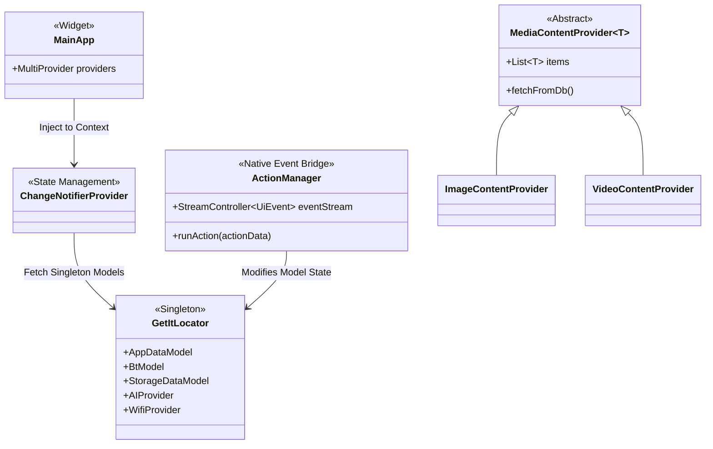
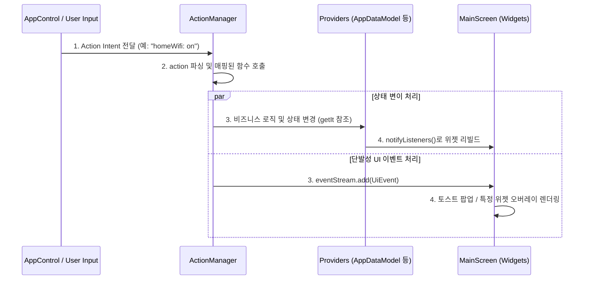

# Architecture Review (Homescreen App)

본 문서는 `lib/` 디렉터리의 핵심 소스 코드를 바탕으로 프로젝트의 기능 모듈, 아키텍처 다이어그램 및 리팩토링 방안을 종합적으로 분석한 결과입니다.

## Step 1. 기능 리스트업 (Feature Inventory)

현재 구현된 주요 기능과 모듈을 논리적 그룹으로 분류하면 다음과 같습니다.

### 1. Core UI & Navigation (코어 화면 및 네비게이션)
- **모듈/파일**: `lib/screen`, `lib/router.dart`
- **주요 기능**: `MainScreen`을 진입점으로 하여 탭 기반의 커스텀 스크롤(페이지 전환) 및 `GoRouter`를 이용한 화면 간 라우팅 처리. 백드롭 스타일의 컨테이너(`BackdropScaffold`)와 하위 페이저 관리.

### 2. Apps Management (앱 관리)
- **모듈/파일**: `lib/apps`, `lib/models/app_data_model.dart`, `lib/native/app_manager.dart`
- **주요 기능**: 타이젠 네이티브 패키지 매니저(`ApplicationManager`)를 통해 설치된 앱, 실행 중인 앱을 조회. 앱 필터링 및 정렬 상태를 `AppDataModel`이 전역으로 관리.

### 3. Native & System Actions (시스템 제어 밎 네이티브 연동)
- **모듈/파일**: `lib/native/action_manager.dart`, `lib/actions`, 커넥티비티 설정들
- **주요 기능**: 볼륨, 와이파이, 블루투스, 기기 이름 변경 같은 시스템 설정을 제어. 타이젠 AppControl이나 로컬 이벤트를 `ActionManager`가 수신하여 파싱하고 `UiEvent` 스트림을 통해 화면에 위젯/토스트 트리거.

### 4. Media & Storage (분류형 미디어 갤러리)
- **모듈/파일**: `lib/media`, `lib/providers/media_data_provider.dart`, `lib/native/content_manager.dart`
- **주요 기능**: 시스템 디렉터리(`/opt/usr/home/owner/media`)를 스캔해 이미지/비디오/최근 파일을 불러옴. Base 클래스인 `MediaContentProvider`를 상속해 각각의 뷰모델 역할을 수행.

### 5. Live TV (실시간 스트리밍)
- **모듈/파일**: `lib/live`
- **주요 기능**: HLS(`.m3u8`) 등을 재생하는 스트리밍 미디어 플레이어(`StreamingVideoPlayer`).

### 6. AI & Voice Agent (인공지능 비서)
- **모듈/파일**: `lib/ai`, `lib/providers/ai_provider.dart`
- **주요 기능**: Gemini 또는 Gauss 모델을 연동하여, 자연어 텍스트/음성 입력을 Tizen 시스템 응답이나 액션으로 변환 및 렌더링. 내부적으로 `McpService` 및 `ActionManager`와 결합하여 액션 수행.

### 7. Settings & Profiles (설정 및 프로필)
- **모듈/파일**: `lib/settings`, `lib/profiles`
- **주요 기능**: 사용자 프로필 전환 관리 및 앱의 환경 설정(네트워크, 기기, 언어 등) 페이지.

---

## Step 2. 구조 및 흐름 도식화 (Mermaid Diagrams)

### 2.1 Class Diagram (의존성 및 상태 관리 구조)
전역 의존성을 `getIt`(Service Locator)으로 관리하고, UI 단의 상태 관리는 `ChangeNotifierProvider`로 공유하는 구조입니다.



### 2.2 Sequence Diagram (이벤트 발생부터 UI 렌더링까지의 흐름)
외부 입력(앱 컨트롤/AI/제스처)에 의해 시스템 액션이 발생했을 때, 상태가 업데이트되고 UI에 반영되는 플로우입니다.



---

## Step 3. 리팩토링 제안 (Refactoring Proposals)

코드베이스 분석 결과, 서로 다른 아키텍처 패턴이 혼용되거나 하나의 클래스에 책임이 과도하게 집중된 부분들이 발견되었습니다. 이를 통일감 있고 깔끔하게 리팩토링할 수 있는 코드 수준의 방안은 다음과 같습니다.

### 제안 1. 단일 책임 원칙(SRP) 위배를 해결하기 위한 Command Pattern 적용 (`ActionManager`)
**개선점 파악:**
`ActionManager`는 모든 종류의 액션(`volumeUp`, `wifiOn`, `liveTv` 등)을 하드코딩된 Map(`_actionFunctions`)과 거대한 내부 private 함수(`_runVolumeAction`, `_runSettingsAction`...)로 직접 처리하고 있습니다. 파일 하나가 시스템 전체 도메인을 아울러 너무 비대해져 유지보수가 어렵습니다.

**리팩토링 방안 (Command Pattern):**
액션 처리를 `ActionHandler` 인터페이스로 캡슐화하고 Registry를 통해 관리하면 OCP(개방-폐쇄 원칙)를 준수할 수 있습니다.

```dart
// 1. 공통 인터페이스 정의
abstract class BaseActionHandler {
  Future<bool> handle(Map<String, dynamic> actionData);
}

// 2. 도메인별 Handler 분리
class WifiActionHandler implements BaseActionHandler {
  @override
  Future<bool> handle(Map<String, dynamic> actionData) async {
    final command = actionData['command'].toString();
    final wifiProvider = getIt<WifiProvider>();
    return command == 'on' ? await wifiProvider.wifiOn() : await wifiProvider.wifiOff();
  }
}

// 3. ActionManager(Registry)의 일원화
class ActionManager {
  static final Map<String, BaseActionHandler> _handlers = {
    'homeWifi': WifiActionHandler(),
    'homeVolume': VolumeActionHandler(),
    // 필요한 핸들러 매핑...
  };

  static Future<bool> runAction(Map<String, dynamic> actionData) async {
    final actionName = actionData['__K_ACTION_NAME'];
    final handler = _handlers[actionName];
    if (handler != null) {
      return await handler.handle(actionData);
    }
    return false;
  }
}
```

### 제안 2. 의존성 주입(Locator)과 상태 관리(Provider) 패턴의 혼용 문제 개선
**개선점 파악:**
`main.dart`를 보면 `ChangeNotifierProvider<AppDataModel>(create: => getIt<AppDataModel>())`와 같이 전역 `get_it` 싱글톤 객체를 다시 Provider 스코프에 넣고 있습니다. 이로 인해 어떤 위젯은 `context.read<AppDataModel>()`로 뷰모델에 접근하고, 어떤 곳(예: `ActionManager`)은 `getIt<AppDataModel>()`로 직접 접근하는 등 상태 접근 채널이 파편화되어 데이터 흐름 추적이 어렵습니다.

**리팩토링 방안:**
- **Repository/Service 계층은 `get_it`에 위임:** `ApplicationManager`, `ContentManager`, `DB Client` 등 순수 로직/데이터 접근 객체만 `get_it` 싱글톤으로 유지합니다.
- **ViewModel/State 계층은 `Provider`에 위임:** `AppDataModel`과 같은 UI 상태 관리 클래스는 더 이상 `get_it`으로 관리하지 않고 순수하게 `Provider`에서 생성 및 라이프사이클을 관리합니다.
- **Provider 간 의존성 주입:** Service에만 `get_it`을 사용하게 되면, ActionManager 같은 외부 계층이 UI 상태를 조작해야 할 때는 전역 키(Navigator Key)를 활용한 Navigation 계층의 이벤트 버스를 사용하거나, ProxyProvider 패턴을 차용해야 합니다.

```dart
// 수정 전 (혼용)
void setupAppModel() {
  getIt.registerLazySingleton<AppDataModel>(() => AppDataModel());
}
// main.dart
ChangeNotifierProvider<AppDataModel>(create: (context) => getIt<AppDataModel>())

// 수정 후 (분리)
// locator.dart에는 Service Layer 만 등록
getIt.registerLazySingleton<ApplicationService>(() => ApplicationService());

// main.dart 에서는 순수하게 상태 관리를 선언
ChangeNotifierProvider<AppDataModel>(
  create: (context) => AppDataModel(appService: getIt<ApplicationService>()),
)
```

### 제안 3. 이중 이벤트 전송 채널(Stream vs ChangeNotifier) 통일
**개선점 파악:**
데이터의 영구적 변경(예: 목록 업데이트, 설정 변경)은 `ChangeNotifier`를 쓰고 있으나, 토스트 팝업이나 오버레이 위젯 호출 같은 일회성 이벤트는 `ActionManager` 내의 글로벌 `StreamController` (`eventStream.listen`)를 이용해 `MainScreen`에서 받습니다.

**리팩토링 방안:**
스트림 이벤트 채널과 뷰모델 상태 업데이트가 따로 노는 것을 막기 위해 전역 App 상태 안에 `Event` 큐를 도입하는 패턴을 사용합니다.

```dart
// 일회성 이벤트를 관리하는 단일 Provider 구축
class GlobalEventProvider extends ChangeNotifier {
  UiEvent? _currentEvent;
  UiEvent? get currentEvent => _currentEvent;

  void emitEvent(UiEvent event) {
    _currentEvent = event;
    notifyListeners();
  }
  
  void consumeEvent() {
    _currentEvent = null;
  }
}

// ActionManager 에서는 싱글톤 대신 컨텍스트(또는 Navigator Key)를 통해 Provider 업데이트
context.read<GlobalEventProvider>().emitEvent(ShowToastMessageEvent('Success'));

// Widget 에서는 Consumer 또는 Provider.listen 을 통해 토스트 발생 처리
```
이렇게 하면 Flutter의 Tree 업데이트 라이프사이클 내에서 안전하고 일관된 단방향 이벤트 플로우를 유지할 수 있습니다.
