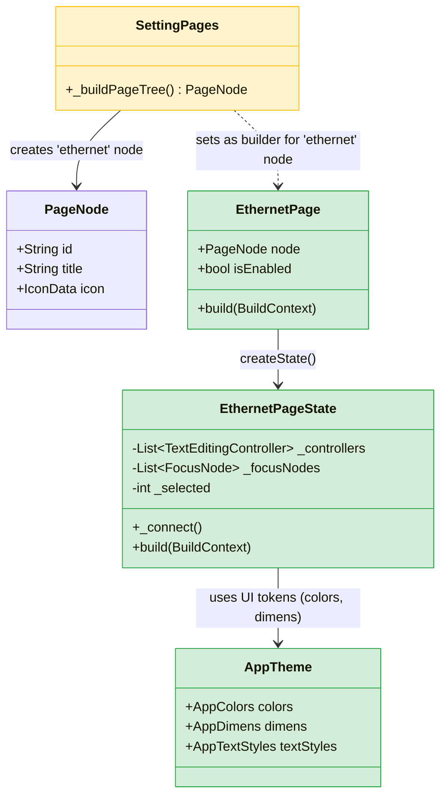

# Issue 6: 유선 네트워크 연결 기능 구현 내역

## 개요
이 문서는 Issue #6 (유선 네트워크 연결 기능 추가) 해결을 위해 구현된 내용, 구조 변경 사항 및 Device API 연동 대기 항목을 정리한 문서입니다. `ui_extraction_pipeline.md`를 통해 사전에 추출된 UI 디자인 토큰을 활용하여 개발이 진행되었습니다.

## 📁 수정 및 추가된 파일 목록

- **🟩 새로 추가된 클래스 및 파일**
  - `lib/theme/app_theme.dart` : UI 컴포넌트 생성을 위한 여백, 색상 등 디자인 토큰 가이드
  - `lib/settings/ethernet_page.dart` : 유선 네트워크(IP, Subnet Mask, Gateway, DNS) 설정 페이지 UI

- **🟨 수정된 기존 클래스 및 파일**
  - `lib/models/settings_menus.dart` : 설정 메뉴 PageTree 내에 `Ethernet` 메뉴 노드 추가 적용
  - `lib/l10n/app_en.arb`, `lib/l10n/app_ko.arb` : "dns", "ethernet" 등 다국어 설정 항목 추가 적용

## 🏗️ 아키텍처 (클래스 다이어그램)

## 🔧 Device API 연동 대기 사항 (TODO)
현재 사용자가 IP, 서브넷 마스크, 게이트웨이, DNS 값을 입력하고 **Connect(연결)** 버튼을 눌렀을 때의 동작 흐름은 갖추어져 있으나, 실제 Tizen OS상에서 네트워크 설정을 변경하는 하드웨어 제어 인터페이스 연동이 아직 적용되어있지 않습니다.

- **위치:** `lib/settings/ethernet_page.dart` 파일의 `_connect()` 메서드 내부
- **구현 대상 (필요 내용):** `// TODO: [Device API] configure wired network settings with given IP, gateway, subnet, and DNS` 주석 기재
- **향후 계획:** 후속 개발 시 네이티브 플랫폼 채널 혹은 Tizen 전용 인터페이스 패키지를 활용해, 입력받은 값으로 유선 장치 인터페이스의 Config를 변경하고 Connection 프로세스를 수행하는 모듈이 추가되어야 합니다.
