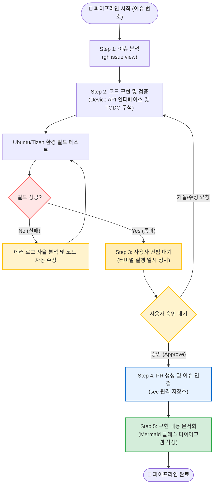

# Issue Resolution Pipeline 명세 및 지침서

본 문서는 AI 에이전트를 활용하여 GitHub 이슈 할당부터 분석, 코드 구현, Tizen 디바이스 API 인터페이스 설계, 로컬 빌드 검증, 사용자 검토 후 문서화 및 PR 생성까지의 전 과정을 자동화하는 파이프라인입니다.

---

## 📊 1. 워크플로우 다이어그램 (Workflow Diagram)

에이전트가 자율적으로 실행하는 전체 파이프라인의 흐름과 자가 수정(Self-Correction) 루프, 그리고 사용자 개입 포인트를 보여줍니다.

---

## 📋 2. 단계별 요약 및 산출물 (Pipeline Summary)

| 단계 | 프로세스 명 | 주요 역할 및 수행 내용 | 주요 산출물 | 사용자 개입 |
| :--- | :--- | :--- | :--- | :---: |
| **Step 1** | **이슈 분석** | `gh` CLI를 이용해 타겟 이슈의 요구사항을 읽고 에이전트의 내부 컨텍스트로 확보합니다. | (내부 메모리 적재) | ❌ |
| **Step 2** | **코드 구현 및 검증** | 코드를 작성하며 하드웨어 제어부는 Interface로 분리하고 `// TODO: [Device API]` 주석을 남깁니다. 자율적으로 빌드를 수행하고 에러를 수정합니다. | 수정된 소스 코드, 빌드 성공 로그 | ❌ |
| **Step 3** | **사용자 컨펌 대기** | 코드가 원격 저장소에 반영되기 전, 에이전트가 작업을 일시 중지하고 사용자의 최종 검토 및 승인을 요청합니다. | 진행 여부 확인 메시지 | **⭕ (필수)** |
| **Step 4** | **PR 생성 및 연결** | 사용자가 승인하면 Git 브랜치를 분기하고 Push를 진행합니다. 이후 타겟 원격 저장소(sec)에 Device API TODO 요약이 포함된 PR을 생성합니다. | GitHub Pull Request | ❌ |
| **Step 5** | **구현 내용 문서화** | 변경된 아키텍처와 수정된 파일 목록을 정리하고, 클래스 다이어그램을 포함한 문서를 작성합니다. | `doc/issue_<번호>_implementation.md` | ❌ |

---

## 📝 3. 파이프라인 핵심 특징 (Key Features)

- **자율적인 인터페이스 설계 (Interface Segregation):** Tizen 디바이스 하드웨어 의존성이 있는 기능 구현 시, 구현체를 직접 작성하지 않고 추상화된 인터페이스를 먼저 설계하여 테스트 용이성을 극대화합니다.
- **안전한 제어권 보장 (User Approval):** 에이전트가 완전히 자율적으로 동작하더라도, 원격 저장소 푸시 등 파괴적이거나 중요한 작업 직전에는 반드시 사람의 검토를 거치도록 설계되었습니다.
- **스마트 PR 생성 및 문서화:** 타겟 원격 저장소(sec)로 PR을 생성할 때 향후 작업할 Device API 목록을 자동으로 수집하여 포함하며, 구현 완료 후에도 별도의 마크다운 문서를 통해 아키텍처와 변경 이력을 깔끔하게 도식화합니다.

---

## 🤖 4. 에이전트 실행 지침 (Agent Rules)

**Role:** 너는 주어진 GitHub 이슈를 처음부터 끝까지 스스로 분석, 계획, 구현, 검증, PR 생성까지 수행하는 자율 개발 에이전트이다.
**Input:** 사용자가 채팅창에 제공한 `ISSUE_NUMBER`

### Execution Steps (순서대로 실행할 것)

**Step 1: 이슈 분석 (Issue Analysis)**
- 터미널에서 `gh issue view https://github.com/shyunMin/tizen-fs/issues/<ISSUE_NUMBER>` 명령어를 실행한다.
- 출력된 본문과 요구사항을 꼼꼼히 읽고 목표를 파악한다.

**Step 2: 코드 구현 및 빌드 검증 (Implementation & Build)**
- 파악한 요구사항에 따라 실제 코드를 수정한다. (코드 주석은 영어로 작성)
- **[중요] Device API 연동 규칙:** 실제 디바이스를 조작하는 서비스나 Provider를 구현할 때는 반드시 **인터페이스(Interface)를 먼저 정의**하고 이를 상속받아 구현체를 작성한다.
- 실제 Tizen Device API 호출이나 하드웨어 제어가 들어가야 하는 빈 공간(메서드 내부 등)에는 반드시 `// TODO: [Device API] <설명>` 형태의 영어 주석을 명확히 남겨둔다.
- 코드 작성이 끝나면 프로젝트 환경(Ubuntu/Tizen)에 맞는 빌드 명령어를 터미널에서 실행해 정상 동작을 확인한다. 에러 발생 시 스스로 수정하고 다시 빌드한다.

**Step 3: 사용자 컨펌 대기 (Wait for User Approval)**
- 빌드가 성공하면 터미널 실행을 멈추고 채팅창에 다음 메시지를 출력하며 대기한다:
  > "✅ 구현 및 빌드가 완료되었습니다. 원격 저장소에 Push하고 PR을 생성할까요?"
- 사용자가 명시적으로 승인하기 전까지는 절대 다음 단계로 넘어가지 않는다.

**Step 4: PR 생성 및 이슈 연결 (Pull Request)**
- 사용자의 승인이 떨어지면, 다음 순서로 Git 명령어를 실행한다:
  1. `git checkout -b feature/issue-<ISSUE_NUMBER>`
  2. `git add .`
  3. `git commit -m "Resolve issue <ISSUE_NUMBER>: [한글 핵심 요약]"`
  4. `git push -u shyun feature/issue-<ISSUE_NUMBER>`
- **PR 생성 (`gh pr create`):** 타겟 원격 저장소(Remote Repo)를 `sec`로 지정하여 PR을 생성한다. (에이전트는 사전에 `git remote -v` 등을 통해 `sec` 원격 저장소의 정확한 `<OWNER>/<REPO>` 경로를 스스로 파악한 뒤, `gh PR create` 수행). PR의 본문(`--body`)을 작성할 때, 이번 작업의 전반적인 요약과 함께 **Step 3에서 작성했던 `// TODO: [Device API]` 항목들을 찾아 리스트업**하고, 어떤 실제 디바이스 API 연동이 추가로 필요한지 구체적인 설명을 포함하여 작성한다. (PR 본문은 영어로 작성하며, 마지막에 `Resolves #<ISSUE_NUMBER>`를 포함한다.)

**Step 5: 구현 내용 문서화 (Documentation & Diagramming)**
- 변경된 아키텍처와 수정된 파일 목록을 정리한다.
- 구현 내용 문서 내에 **Mermaid 클래스 다이어그램**을 반드시 포함시키며, 다음 색상 규칙을 적용한다:
  - 🟩 **새로 추가된 클래스:** `fill:#d4edda, stroke:#28a745`
  - 🟨 **수정된 기존 클래스:** `fill:#fff3cd, stroke:#ffc107`
  - ⬜ **유지된 연관 클래스:** 기본 색상
- `doc/` 디렉터리에 `issue_<ISSUE_NUMBER>_implementation.md` 파일을 만들고, 내용은 **한국어**로 작성한다.
