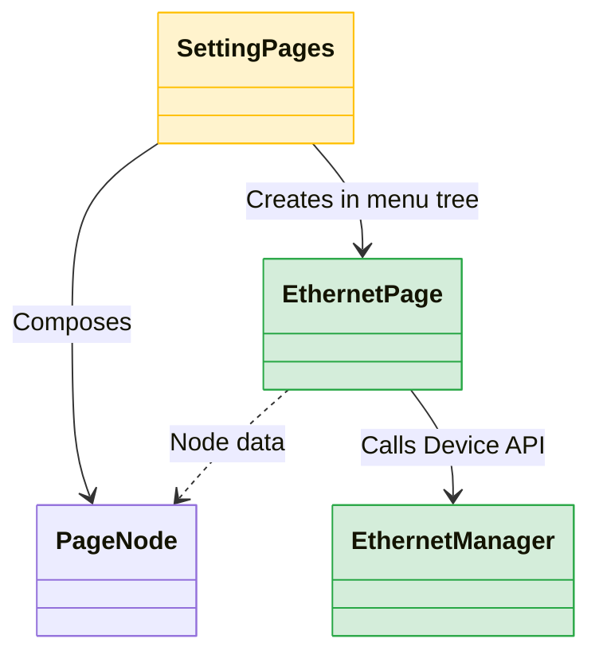

# 이슈 #6 구현 계획서 (Wired Network 메뉴 추가)

## 개요
이슈 #6의 요구사항에 따라 `settings` 메뉴에 Wi-Fi 외에 유선 연결(Ethernet) 메뉴를 추가하고, 사용자가 IP, Gateway, Subnet, DNS를 입력할 수 있는 UI를 제공합니다.

## 변경할 아키텍처 및 수정 파일 파악
1. **Device API 인터페이스 추가 (`lib/native/ethernet_manager.dart` [NEW])**
   - Tizen API 연동을 위한 규격(인터페이스) 정의 및 실제 호출부가 들어갈 메서드 추가 (내부 `// TODO: [Device API]` 작성).
2. **신규 UI 컴포넌트 추가 (`lib/settings/ethernet_page.dart` [NEW])**
   - 유선 네트워크 정보를 입력받을 수 있는 `EthernetPage` 위젯 추가.
   - 내부적으로 `TextField`를 사용하여 IP, Gateway, Subnet Mask, DNS 정보를 입력하는 UI 구성.
3. **설정 메뉴 트리에 반영 (`lib/models/settings_menus.dart` [MODIFY])**
   - `SettingPages` 클래스의 `_buildPageTree` 메서드에서 `wifi` 메뉴 하단 또는 근처에 `ethernet` (유선 네트워크) 노드를 추가.
   - 해당 노드의 `builder`에 `EthernetPage`를 연결하여 라우팅 되도록 설정.
3. **다국어 지원 (`lib/l10n/` [MODIFY])**
   - 사용자 UI 노출용 텍스트 추가.

## Mermaid 클래스 다이어그램

## 검증 계획
- `flutter run` 또는 정적 분석 도구로 에러 확인.
- Tizen 기기/에뮬레이터에서 Settings > Ethernet 메뉴 접속 여부 확인.
